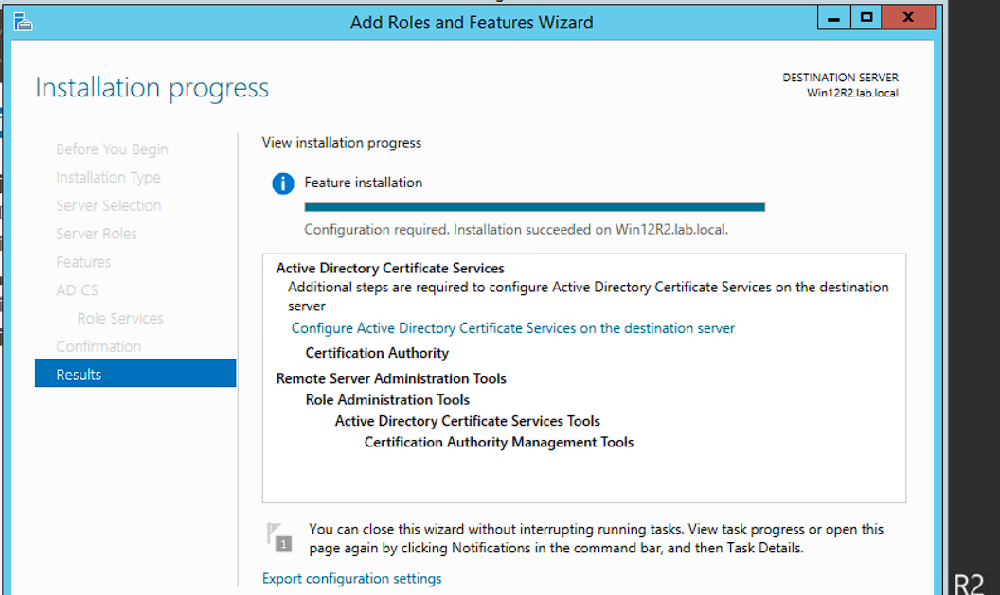
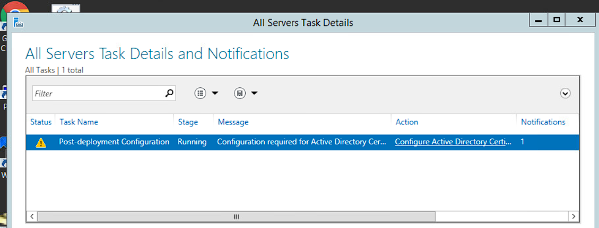
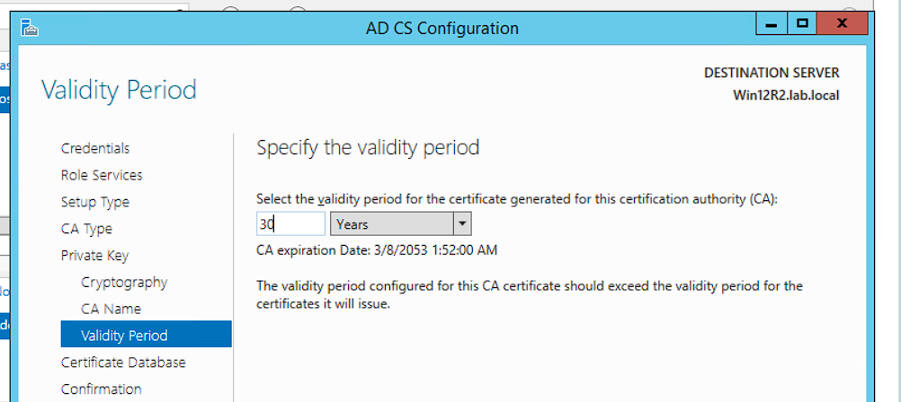
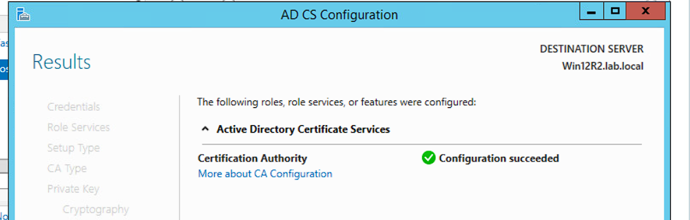

<div align="center">

# PKI Infrastructure Lab — Windows Server 2012 R2
### Security+ Lab · Public Key Infrastructure · CIS195 · Cypress College

[]()
[]()
[]()

</div>

---

## Overview

```text
Objective  : Deploy a standalone Root Certificate Authority using AD CS on Windows Server
Environment: Win12R2 (CA server) · pfSense (firewall) · Kali Linux · Ubuntu · SecOnion
Network    : DMZ 10.1.1.0/28 · Internal 192.168.1.0/24 · External 203.0.113.0/29
Date       : March 2023
Course     : CIS195 — CompTIA Security+ · Cypress College
```

Configured a Windows Server 2012 R2 machine as a standalone Root Certificate Authority using Active Directory Certificate Services (AD CS). This lab simulates the PKI deployment process used in enterprise environments to issue and manage digital certificates for secure communication across a segmented network.

---

## Lab Environment

| Machine | Role | IP Address |
|---|---|---|
| Win12R2 | CA server — AD CS host | 10.1.1.12 /28 |
| pfSense | Firewall / Router | 10.1.1.1 (DMZ) · 192.168.1.1 (Internal) · 203.0.113.1 (External) |
| Kali Linux | External attacker perspective | 203.0.113.2 /29 |
| Ubuntu | Internal client | 192.168.1.50 /24 |
| SecOnion | Network monitoring | 192.168.1.6 /24 |
| Win16 | Internal workstation | 192.168.1.100 /24 |

---

## What is PKI?

Public Key Infrastructure is the framework that enables secure communication across untrusted networks. It uses asymmetric cryptography — a public/private key pair — along with digital certificates issued by a trusted Certificate Authority to authenticate identities and encrypt data.

**Two most critical security aspects:**

**1. Authentication** — Digital certificates prove that a user, device, or service is who it claims to be. Without a trusted CA signing those certificates, there is no reliable identity verification across a network.

**2. Encryption integrity** — The CA's digital signature on each certificate prevents tampering or forgery. If a certificate is altered after signing, the signature breaks and the certificate is rejected.

---

## What is AD CS?

Active Directory Certificate Services is Microsoft's PKI implementation built into Windows Server. It allows organizations to issue and manage digital certificates internally — without relying entirely on third-party CAs like DigiCert or Let's Encrypt.

AD CS supports SSL/TLS for internal web services, VPN authentication, Wi-Fi 802.1X, and smart card logon. It integrates with Active Directory to automate certificate enrollment for domain-joined machines and users via Group Policy.

---

## Configuration Steps

### Step 1 — Install the AD CS Role

Navigated to **Server Manager → Manage → Add Roles and Features**, selected role-based installation on `Win12R2.lab.local`, and added the **Active Directory Certificate Services** role with Certification Authority Management Tools.



---

### Step 2 — Post-Deployment Configuration

After installation, Server Manager flagged that additional configuration was required. Clicked the **"More"** link in the yellow notification bar to launch the AD CS Configuration wizard.



---

### Step 3 — Configure the Certificate Authority

Key decisions made during the wizard:

| Setting | Value chosen | Reason |
|---|---|---|
| Setup Type | **Standalone CA** | No AD DS dependency — mirrors an offline root CA design used in real PKI hierarchies for security |
| CA Type | **Root CA** | Trust anchor for this lab — the first and only CA in the hierarchy |
| Private Key | **Create new** | No existing key infrastructure to carry forward |
| Cryptographic Provider | RSA · Microsoft Software Key Storage Provider | Industry-standard for lab environments |
| Key Length | **2048-bit** | Minimum acceptable for RSA; production now favors 4096-bit |
| Hash Algorithm | **SHA1** | Lab default — in production SHA256 minimum is required; SHA1 is deprecated |
| Validity Period | **30 years** | Extended to reduce lab overhead; production root CAs typically use 5–20 years |
| Certificate Database | C:\Windows\system32\CertLog | Default Windows path |



---

### Step 4 — Verify CA is Operational

After clicking **Configure**, navigated to **Tools → Certification Authority** in Server Manager. Green icon next to the server name confirmed the CA was live and ready to issue certificates.



---

## Key Decisions and Trade-offs

**Standalone vs Enterprise CA**

Chose Standalone CA because the lab environment had no requirement for AD DS integration. In a production environment with domain-joined machines, an Enterprise CA is preferred — it enables auto-enrollment via Group Policy, which eliminates manual certificate requests at scale. For an isolated or offline root CA (which is best practice), Standalone is actually correct.

**SHA1 hash algorithm**

The lab defaults to SHA1. This is worth flagging explicitly — SHA1 is cryptographically broken and has been rejected by major browsers and operating systems since 2017. In any real deployment, SHA256 is the minimum. SHA384 or SHA512 are preferred for long-lived root CA certificates.

**30-year validity period**

Root CA certificates intentionally carry long validity periods because rotating a root CA requires re-issuing every subordinate certificate it signed — a massive operational effort. However, the leaf certificates issued *by* the CA should have much shorter lifespans (1–2 years maximum) to limit the blast radius of any compromise.

---

## What I Would Do Differently in Production

**Add a subordinate CA.** Best practice is to keep the root CA offline and air-gapped. A subordinate (issuing) CA handles day-to-day certificate requests. The root only comes online to sign the subordinate's certificate, then gets powered off and locked away. This limits exposure if the issuing CA is ever compromised.

**Configure CRL distribution points.** Certificate Revocation Lists must be accessible to clients so they can verify a certificate hasn't been revoked. Without CRL or OCSP endpoints, a compromised certificate remains trusted until it naturally expires.

**Enforce certificate templates via GPO.** Group Policy can automate enrollment for domain machines — users and devices get certificates without manual requests, reducing both admin overhead and human error.

**Use SHA256 minimum.** No exceptions. SHA1 should never appear in a new deployment.

**Shorter validity on issued certificates.** 90 days to 1 year for user/device certs. Never match the root CA validity period on anything downstream.

---

## Concepts Demonstrated

- Public Key Infrastructure (PKI) architecture and trust hierarchy
- Active Directory Certificate Services (AD CS) role installation
- Root CA vs Subordinate CA design decisions
- Cryptographic settings — algorithm selection, key length, validity periods
- Certificate database configuration
- Windows Server 2012 R2 Server Manager role management
- Network segmentation — DMZ, Internal, and External zone design
- Post-deployment configuration workflow

---

## Related Credentials

[](https://github.com/Mvrcoz)
[](https://tryhackme.com/p/Marcoz)
[](https://www.linkedin.com/in/marcoz-tech/)

`pki` `windows-server` `active-directory` `ad-cs` `certificate-authority` `cryptography` `security-plus` `cybersecurity` `homelab`
